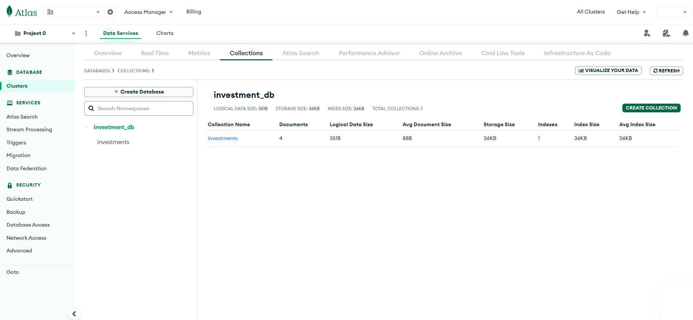
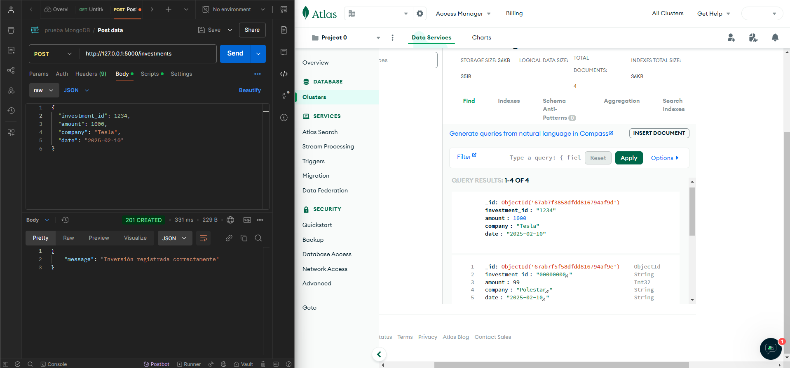
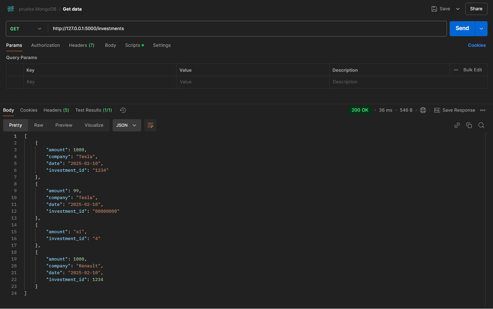

## **Descripción del Proyecto**
Este proyecto es una **API REST** desarrollada con **Flask** y **MongoDB Atlas**, creada para **gestionar inversiones**.  
El objetivo principal de esta API es **demostrar habilidades en MongoDB**, como parte del proceso de selección.

## **Ejemplo de Uso**

**Base de Datos en MongoDB Atlas**  

**Insertar una Inversión (`POST /investments`)**  

**Consultar las Inversiones (`GET /investments`)**  

